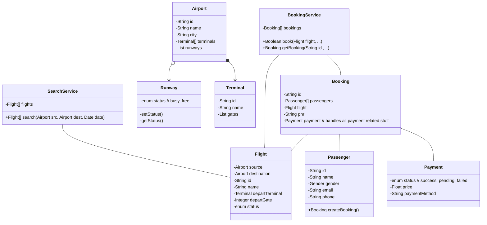

# Airline Management System LLD

Functional requirements:

1. Search for a flight
2. Book a flight  
3. Operate an airport 
4. Passenger details

Non-Functional requirements:
1. Scalability
2. Reliability
3. Performance
4. Security
5. User-Friendliness
6. Interoperability

## Actors
1. Passenger
2. Admin

## Use Cases
1. Passenger can book a ticket
2. Passenger can select a seat
3. Admin can create Flights
4. Passenger can do a Payment
5. Passenger can check in Luggage
6. Passenger can cancel a Booking
7. Passenger can see its Bookings
8. Admin can change Flight status

## Entities
1. Airport
2. Flight
3. Booking
4. Terminal
5. Runway
6. Luggage
7. Seat

## Relationships
1. Passenger has a Booking
2. Booking can have multiple Passengers
3. Booking a Seat of a Flight
4. Flights land on Runway
5. Admin controls Flights
6. Flight has a Source city
7. Flight has a Destination city

### Note
We are not focusing on Payment because it is quite common thing and can be done in a separate LLD discussion.

