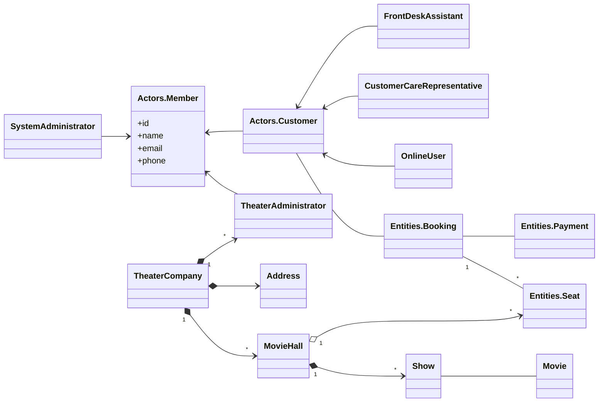

# Movie Entities.Booking System

## Requirements
1. System should list the cities where affiliate cinemas are located
2. Each cinema can have multiple halls and each hall can run one movie show at a time
3. Each movie can have multiple shows
4. Customers can search movies based on
    - title
    - language
    - genre
    - release date
    - city name
5. Once a movie is selected, the system should display the cinemas running that movie and its available shows
6. Actors.Customer can select a show at a particular cinema and book tickets
7. System should show the seating arrangement of the cinema hall. The customer can select multiple seats
8. Actors.Customer should be able to distinguish between available seats and booked seats
9. System should ensure that no two customers can reserve the same seat (thread safety while selecting and booking seats)

## Actors
- Actors.Customer - online user
- Actors.Customer Care Representative - booking via call
- Front Desk Assistant - present at the movie hall, in-person booking
- Theater Administrator - updates system with new movies information and remove inactive ones, employee of Theater company
- System Administrator -  responsible for onboarding theater clients, employee of Movie Entities.Booking System

## Entities
- Theater Company
- Theater Locations (Cinema Hall / Multiplex)
- Movie
- Movie Show (2D/3D/time based)
- Entities.Seat
- Entities.Booking
- Entities.Payment

## Basic Design

## Use Cases
1.
## Constraints

## Bottlenecks

## Scalability