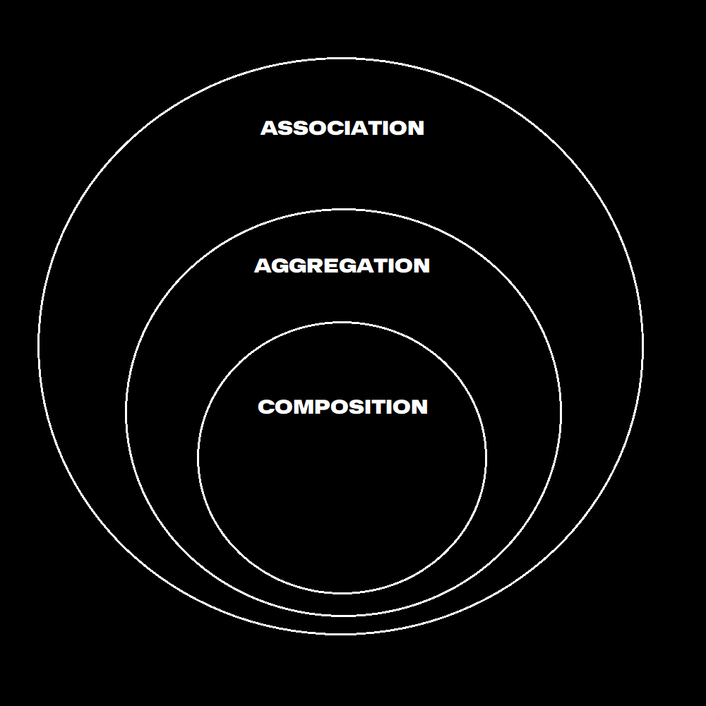
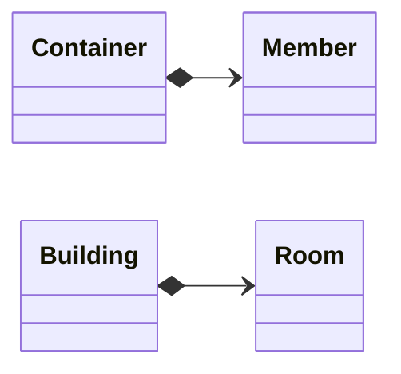
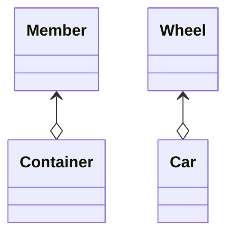
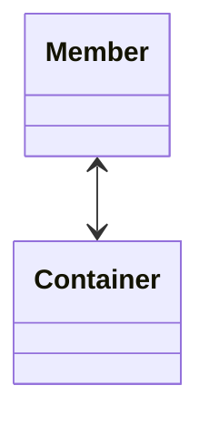
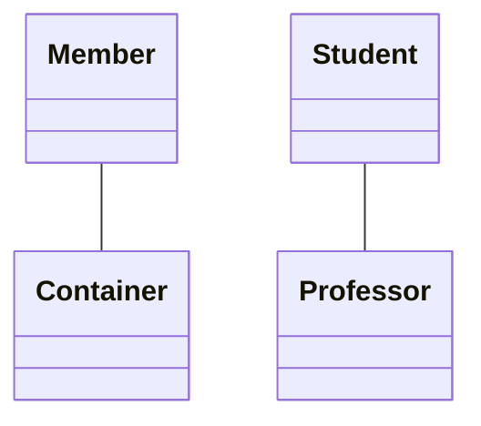

# LLD

### *The high-level design fixes the **what**, and the low-level design is all about the **hows***

Exhaustive component level design process of your application. It includes:

- Designing data structures
- Designing database
- Designing your classes and interfaces
- Designing algorithms
- Implementing various design patterns to ease development

## How to approach?

1. **Use Cases Generation**: Gather all the possible use cases
2. **Constraints and Analysis**: How many users, how much data etc.
3. **Basic Design**: Most basic design, few users case
4. **Bottlenecks**: Find the bottlenecks and solve them
5. **Scalability**: A large number of users

## Initial Steps
- Identify the **Actors**
- Identifying the **use cases** that the Actors will be engaged in
- Identify all the **Entities** and **Attributes**

## LLD Document

It is a heavy-duty, bulky document that contains the pseudocode for the developers. The main objective is to mitigate any additional burden developers face during the development phase by clearly laying out details. It acts as a reference material for the developers.

### Table of Contents
* [Association, Aggregation, Composition](#association-aggregation-composition)

---

## Association, Aggregation, Composition

### Composition
- Composition is a "belongs-to" type of relationship.
- One of the object is logically larger structures, which contains the other object
- it's part or member of the other object
- it is a strong kind of _has-a_ relationship because the containing object owns it
- therefore, the objects' lifecycles are tied - if we destroy the owner object, its members will also be destroyed with it
- composition is denoted by a diamond (diamond is at the containing object)

### Aggregation
- Aggregation is also a _has-a_ relationship
- but it doesn't involve owning
- the lifecycles of the object are not tied to each other (can exist independently)
- assemble the parts to a bigger construct, which is capable of more things than its parts
- a member doesn't need to be tied to a single container
- denoted by an empty diamond

### Association
- Association is the weakest link among the three
- it isn't a _has-a_ relationship
- none of the objects are part of the other
- the object just know each other
- denoted by a simple arrow, bi-directional arrow, or just a line

### How to tell a difference between Aggregation and Association?
We can't tell the difference by just looking at the code, the difference is only logical.

