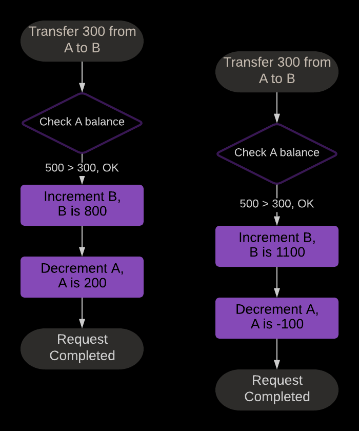
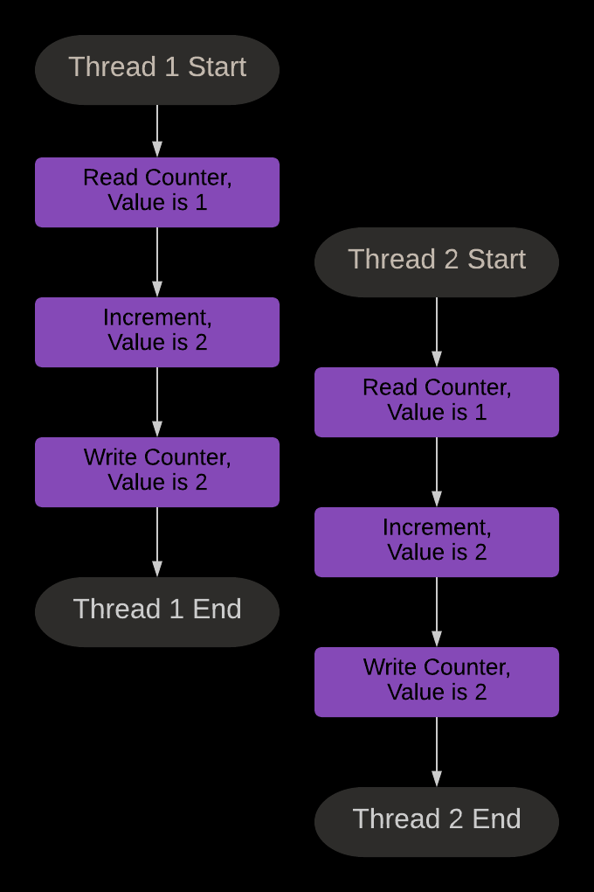

# Race Condition

A race condition is a concurrency problem that may occur inside a critical section. A *critical section* is a section of code that is executed by multiple threads and where the sequence of execution for the threads makes a difference in the result of the concurrent execution of the critical section.  This kind of behavior is non-deterministic.

**Thread-safe** is the term we use to describe a program, code, or data structure free of race conditions when accessed by multiple threads.

## Two Types of Race Conditions

### **1. Check-Then-Act:** 
This is the most common type of race condition. It's defined by a program flow where a potentially stale observation is used to decide what to do next. The bugs produced by this condition are called **TOCTOU** (Time-Of-Check-to-Time-Of-Use) bugs.

Example: funds transfer between 2 bank accounts

```python
def TRANSFER(amount, accountSource, accountTarget):
	if accountSource.balance < amount:
		return
	else:
		accountSource.balance -= amount
		accountTarget.balance += amount
```

Now, if 2 attempts are kicked off simultaneously, in different processes or threads, there may be undesired behavior, as shown in the below flowchart.




Given unpredictable thread scheduling, the order of specific steps is **arbitrary**.
This is a Race Condition due to the **interleaving of our execution flows**.


### **2. Read-Modify-Write**: 
Consider the following code.
```cpp
int counter = 0;
int generateID() {
	return counter++;
}
```

Two or more threads first read a given variable, then modify its value and write it back to the variable. For this to cause a problem, the new value must depend one way or another


This type of race condition is closely related to Data Race.

### Data Race
A data race occurs when two threads access the same variable concurrently and one of the accesses is a write operation.

### Heisenbugs
The bugs introduced by race conditions are called **heisenbugs**
Multi-threaded unit tests with a focus on test result stability will help but are unlikely to provide a 100% guarantee.

## Techniques to eliminate race conditions
There are 2 approaches:
### 1. Avoiding shared state
Using immutable objects as much as possible is always advisable. Thread-local variables, localized in such a way that each thread has its private copy

### 2. Using synchronizations and atomic operations
Using synchronization primitives, locks, mutex etc.

# Actor-based concurrency
