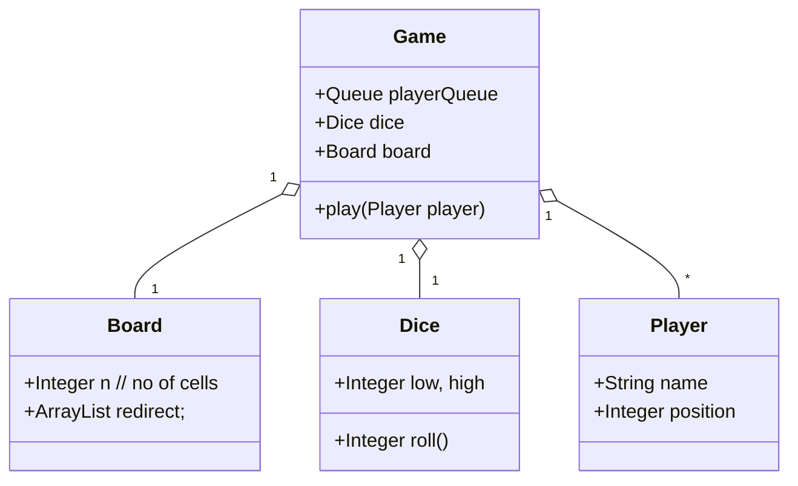

# Snakes and Ladders - Low Level Design

## Requirements
- A board with _n_ number of cells starting from 1
- _p_ number of players
- Custom Dice can be made

```mermaid
classDiagram

class Player {
    +String name
    +Integer position
}

class Dice {
    +Integer low, high
    +Integer roll()
}

class Board {
    +Integer n // no of cells
    +ArrayList<Integer> redirect;
}

class Game {
    +Queue<Player> playerQueue
    +Dice dice
    +Board board
    +play(Player player)
}

Game "1" o-- "1" Board
Game "1" o-- "1" Dice
Game "1" o-- "*" Player

```