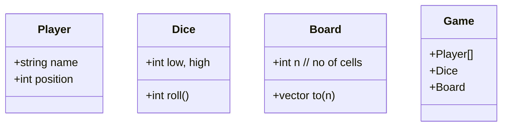

# Snakes and Ladders - Low Level Design

```mermaid
classDiagram

class Player {
    +string name
    +int position
}

class Dice {
    +int low, high
    +int roll()
}

class Board {
    +int n // no of cells
    +vector<int> to(n)
}

class Game {
    +Player[]
    +Dice
    +Board
}


```